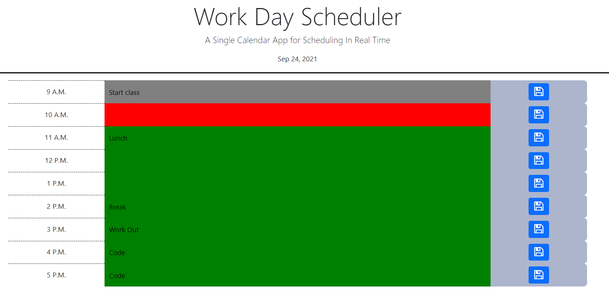

# Work-Day-Scheduler
This app utilizes javascript with the jQuery framework to allow users to input their hourly events for the day. This project also used elements from Bootstrap to help with the HTML and CSS as well as Moment.js to help keep track of time.

Mock Up
---
